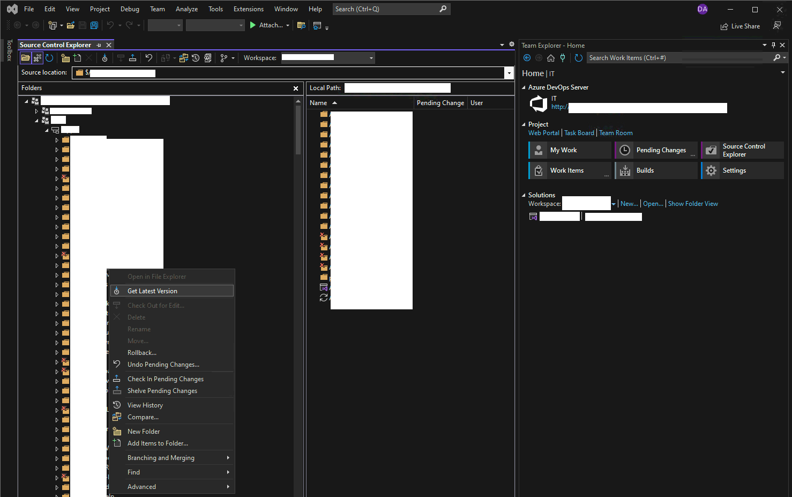
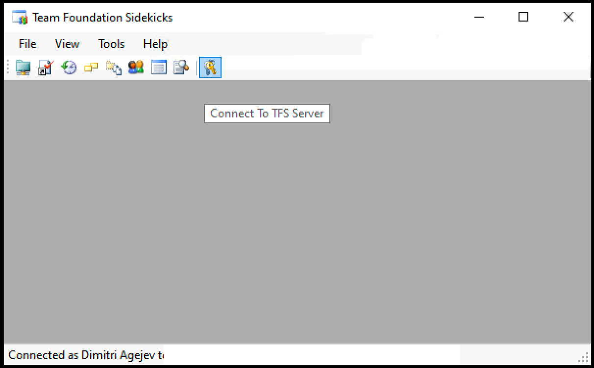
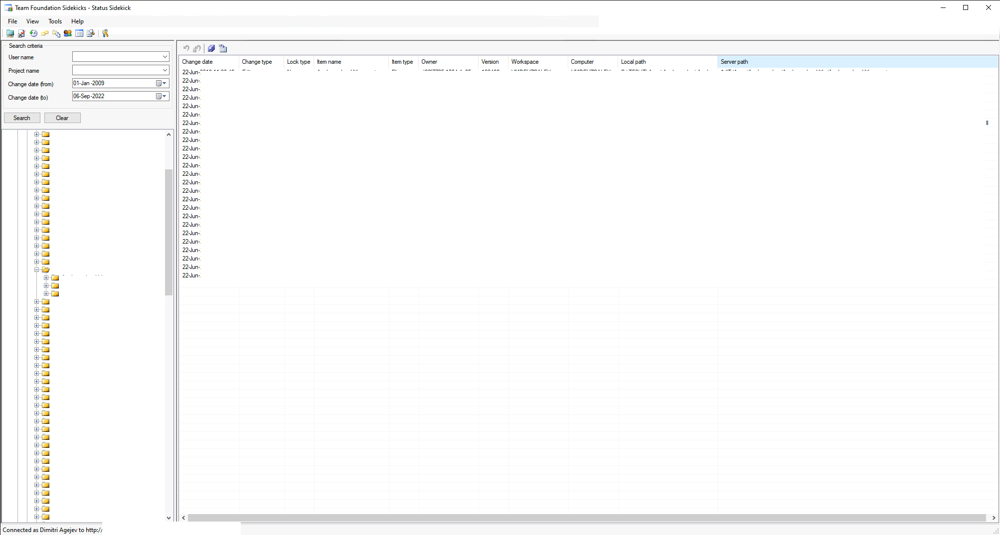
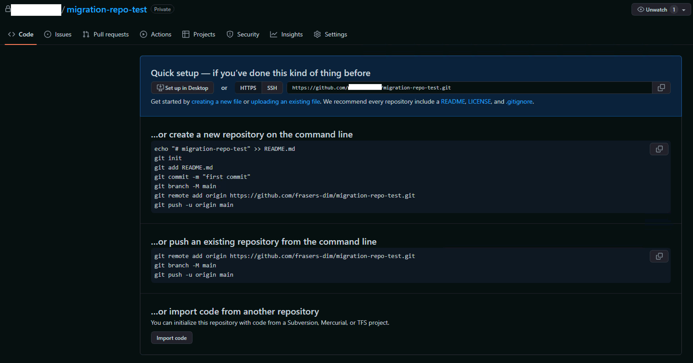
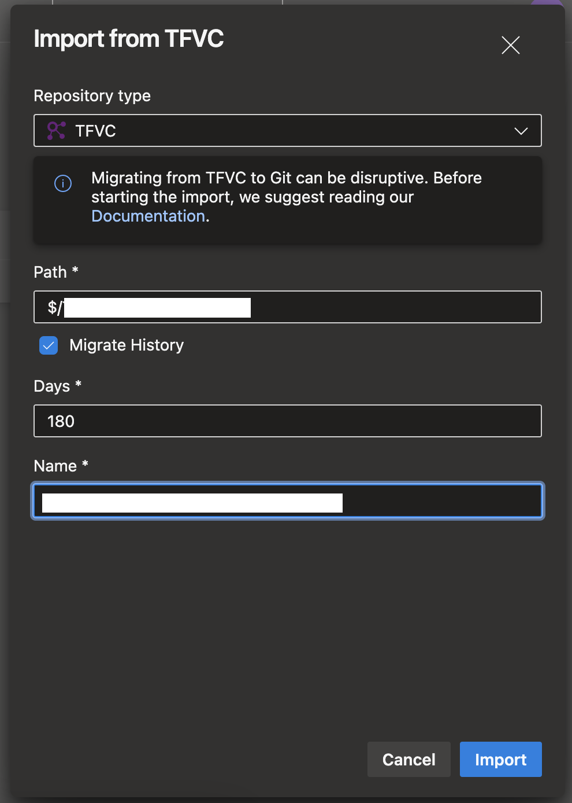
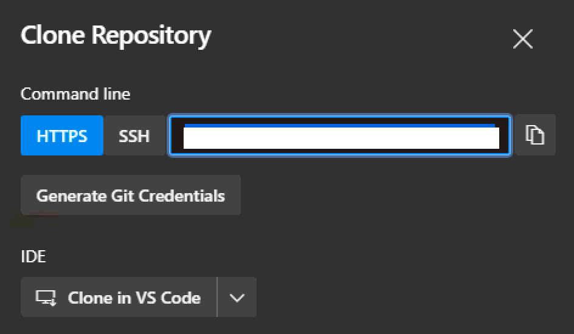
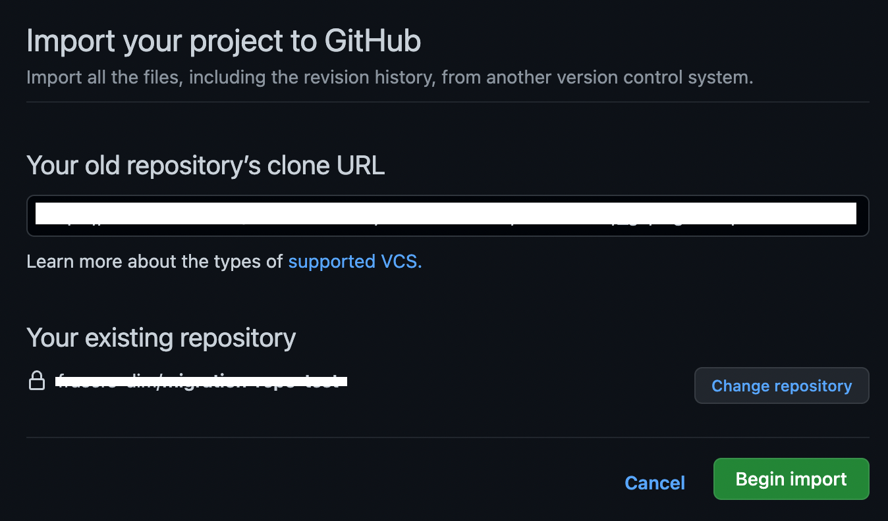

# Getting Started
- This repository holds the scrips required for the migration of TFS and Azure DevOps source code to GitHub.
- Includes Git TF packages and PowerShell Scripts

<br />

<!-- Prerequisits. This list outlines what is required prior to any installations or executions -->
## Prerequisites
- GitHub Access.
- GitHub Repo create and import access.
- Azure DevOps Access.
- TFS Access.
- Contributor permission to Azure DevOps repository.
- Visual Studio 2012 (for lock checks).
- Visual Studio 2019 or later.
<!-- Enf of Prerequisites section -->

<br />

<!-- Installation instructions. This covers all the required downloads and installs needed in order to use the migration scripts. -->
## Installation
### 1. Git
   1. Download Git and follow instructions to install: https://git-scm.com/downloads

<br />

### 2. Chocolatey
   1. Launch cmd as admin and execute:
      <!-- Code snippet -->
      ```
      @"%SystemRoot%\System32\WindowsPowerShell\v1.0\powershell.exe" -NoProfile -InputFormat None -ExecutionPolicy Bypass -Command "iex ((New-Object System.Net.WebClient).DownloadString('https://chocolatey.org/install.ps1'))" && SET "PATH=%PATH%;%ALLUSERSPROFILE%\chocolatey\bin"
      ```
      <!-- Info note describing example. This is just a single row table that makes it look like the note is in a box -->
      > :information_source: &nbsp; The above command essentially opens PowerShell, downloads Chocolatey and sets path. 


<br />

### 3. Git TF
#### 1. Download Git TF
   1. Download git-tf-2.0.3.20131219.zip
   2. Open Git-TF-GettingStarted.html and follow instuctions

#### 2. Set up Git TF
   1. Open cmd as admin and executing command: ` cinst Git-TF `
   2. Using cmd (as admin) open the **git-tf** file using command: ` notepad C:\ProgramData\chocolatey\lib\Git-TF\Tools\git-tf-2.0.3.20131219\git-tf `
   3. Replace __"MINGW32_NT*"__ with __"MINGW*"__ , save and close notepad.
      <!-- Collapsed section example  -->
      <p></p>
      <details>
         <summary><b>Click here to see example...</b></summary>
         <p></p>
      </details>
      <p></p>
      
   4. In cmd check if git tf is installed using command: ` git tf `
      <!-- Collapsed section example  -->
      <p></p>
      <details>
         <summary><b>Click here to see example...</b></summary>
         <p></p>
      </details>
      <p></p>

<br />

### 4. Team Foundation Sidekicks 
   <!-- Info note describing example. This is just a single row table that makes it look like the note is in a box -->
   > :information_source: &nbsp; You need to have Visual Studio 2012 installed in order for the download to work!
   

   1. Download and open **TF_Sidekicks_4_5_0.msi**
   2. When prompted, input your local user name
      <!-- Collapsed section example  -->
      <p></p>
      <details>
         <summary><b>Click here to see example...</b></summary>
         <p></p>
      </details>
      <p></p>      
<!-- End of Installation section -->

<br />

# Usage
<!-- This section defines the TFS to GitHub instructions -->   
## TFS to GitHub Migration
### 1. Check for any user locks
   1. Open Visual Studio (latest version) and connect to TFS.
   2. In the **Solution Explorer**, open the **Source Control Explorer**.
   3. Find your repo, right click and click **Get Latest Version**.
      <!-- Collapsed section example  -->
      <p></p>
      <details>
         <summary><b>Click here to see example...</b></summary>
         <p></p>
      </details>
      <p></p>

   4. Open Team Foundation Sidekicks 2012.
   5. Click **Connect to TFS Server** icon.
      <!-- Collapsed section example  -->
      <p></p>
      <details>
         <summary><b>Click here to see example...</b></summary>
         <p></p>
      </details>
      <p></p>

   6. Input TFS Url (http://vmtfs01.sportski.com:8080/defaultcollection) and click **Connect**.
      <!-- Collapsed section example  -->
      <p></p>
      <details>
         <summary><b>Click here to see example...</b></summary>
         <p></p>
      </details>
      <p></p>

   7. Click on the **Status Sidekick** icon.
      <!-- Collapsed section example  -->
      <p></p>
      <details>
         <summary><b>Click here to see example...</b></summary>
         <p></p>
      </details>
      <p></p>

   8. Remove the set user name, change date from to 01-Jan-2009 and click search (It may take a while to get the results).
      <!-- Collapsed section example  -->
      <p></p>
      <details>
         <summary><b>Click here to see example...</b></summary>
         <p></p>
      </details>   
      <p></p>

   9. Once you get results, navigate to your repository of choice and review the locked user. Filter by Server path to make it easier.
      <!-- Collapsed section example  -->
      <p></p>
      <details>
         <summary><b>Click here to see example...</b></summary>
         <p></p>        
      </details>  
      <p></p>
                
   10. Check with the teams and user if they need the files locked.
   11. If not, then select the locks and click on the **Undo pending change** icon to remove the locks.
       <!-- Collapsed section example  -->
       <p></p>
       <details>
         <summary><b>Click here to see example...</b></summary>
         <p></p>        
       </details>  
       <p></p>

<br />

### 2. Migrate TFS repo to GitHub
   1. Open Visual Studio (latest version) and connect to TFS.
   2. In the **Solution Explorer**, open the **Source Control Explorer**.
   3. Find your repo, right click and click **Advanced > Lock**.
      <!-- Collapsed section example  -->
      <p></p>
      <details>
         <summary><b>Click here to see example...</b></summary>
         <p></p>
      </details>
      <p></p>

   4. Inform the team of the repo that you intend to migrate the code.
   5. Create a new empty GitHub repository.
      <!-- Collapsed section example  -->
      <p></p>
      <details>
         <summary><b>Click here to see example...</b></summary>
         <p></p>
      </details>
      <p></p>

   5. Open PowerShell as Admin and ` cd ` into the same location as the MigrateTfsToGit-Execute.ps1
   6. In PowerShell as Admin, open file **MigrateTfsToGit-Execute.ps1**
   7. Modify the variables to match the source and destination repository paths.
   8. Save and execute.
      <!-- Collapsed section example  -->
      <p></p>
      <details>
         <summary><b>Click here to see example...</b></summary>
         
         <!-- Info note describing example. This is just a single row table that makes it look like the note is in a box -->
         > :information_source: &nbsp; In the example below the "EDI_Viewer" repository is migrated from TFS to the migration-test-repo-tfs repository that is owned by the user frasers-dim.

         <!-- Table of example scenario -->
         | Variable Names | Description | Example Value |
         | -------------- | ----------- | ------------- |
         | TfsUrl | Source repository connection address and port. | http://vmtfs01.sportski.com:8080/tfs/defaultcollection |
         | TfsPath | Source repository path folder. If unsure you can get this by connecting to TFS in Visual Studio using the Source Control Explorer. | /IT/Apps/EDI_Viewer | 
         | RepoUrl | Destination repository URL (GitHub, AzureDevOps). For GitHub you need to include the .git extension at the end of the URL. | https://github.com/frasers-dim/migration-test-repo-tfs.git | 
         | RepoDirectory | The directory path on your machine that the source repository will be cloned to before it is pushed to the destination repository. | C:\Users\dagejev\source\repos |
         | RepoFolder | The folder that will be used to house the cloned repository on your machine. | EDI_Viewer |
         | Branch | The master branch name that will be set in the destination repository. Frasers use "main" as the master branch. | main |
         
         <!-- Code snippet -->
         ```
         .\MigrateTfsToGit.ps1 -TfsUrl 'http://vmtfs01.sportski.com:8080/tfs/defaultcollection' -TfsPath '$/IT/Apps/EDI_Viewer' -RepoUrl 'https://github.com/frasers-dim/migration-test-repo-tfs.git' -RepoDirectory 'C:\Users\dagejev\source\repos' -RepoFolder 'EDI_Viewer' -Branch 'main'
         ```
         <p></p>
      </details>
      <p></p>        
<!-- End of TFS to GitHub section -->

<br />

<!-- This section defines the Azure DevOps to GitHub instructions -->   
## Azure DevOps to GitHub 
### 1. Generate PAT 
   1. In Azure DevOps, in the top menu bar click on the user settings icon and click on **Personal Access Token**.   
      <!-- Collapsed section example  -->
      <p></p>
      <details>
         <summary><b>Click here to see example...</b></summary>
         <p></p>
      </details>
      <p></p>   

   2. Click on **+ New Token**
   3. Give the PAT a name and in the **Code** scope tick the **Read** checkbox and click **Create**.
      <!-- Collapsed section example  -->
      <p></p>
      <details>
         <summary><b>Click here to see example...</b></summary>
         <p></p>
      </details>
      <p></p>

   4. Take note of the PAT key. You will need this later.
      <!-- Collapsed section example  -->
      <p></p>
      <details>
         <summary><b>Click here to see example...</b></summary>
         <p></p>
      </details>
      <p></p>

<br />

### 2. Migrate Azure DevOps (Git) to GitHub
   1. Navigate to your source repository of choice.
      <!-- Info note describing example. This is just a single row table that makes it look like the note is in a box -->
      > :information_source: &nbsp; **If the repo you are working with is a TFVC, you need to migrate it to Git first!** Follow the steps bellow. 

      <details>
      <summary><b>Click here to expand TFVC to Git Migration steps...</b></summary>
      <p></p>
      
      <!-- This section defines the Azure DevOps to Git to GitHub instructions -->   
      1. Make sure the default branching setting is enabled and set to "main". This can be done in Project Settings > Repos > Repositories
            <!-- Collapsed section example  -->
            <p></p>
            <details>
               <summary><b>Click here to see example...</b></summary>
               <p></p>
            </details>
            <p></p> 

      2. Navigate to your source repository of choice.  
            <!-- Collapsed section example  -->
            <p></p>
            <details>
            <summary><b>Click here to see example...</b></summary>

            <!-- Info note describing example. This is just a single row table that makes it look like the note is in a box -->
            > :information_source: &nbsp; Indiciations that it is a TFVC repo: 
            > | | | 
            > | --- | --- |
            > | The repo will have this icon: |  |
            > | The repo name will have this prefix: | **$/** |
            > | The clone button will be missing: | 
            
            <p></p>
            </details>
            <p></p>  
   
      3. Click **Import Repository**
            <!-- Collapsed section example  -->
            <p></p>
            <details>
               <summary><b>Click here to see example...</b></summary>
               <p></p>
            </details>
            <p></p> 
      
      4. Input parameters, enable history and set to 180 days, and click **Import**
            <!-- Collapsed section example  -->
            <p></p>
            <details>
               <summary><b>Click here to see example...</b></summary>
               <p></p>
            </details>
            <p></p> 
      
      5. Now you should have a Git repo in the same project. Proceed with the next steps to migrate to GitHub

   2. Make sure you are on the main branch and click **Clone**
   3. Copy the HTTPs URL.
      <!-- Collapsed section example  -->
      <p></p>
      <details>
         <summary><b>Click here to see example...</b></summary>
         <p></p>
      </details>
      <p></p>

   4. Create a new empty GitHub repository, navigate to it and click on **Import code...**
   5. Paste the copied Azure DevOps HTTPs URL and click **Begin Import**
      <!-- Collapsed section example  -->
      <p></p>
      <details>
         <summary><b>Click here to see example...</b></summary>
         <p></p>
      </details>
      <p></p>
      
   
   6. Follow the instructions and when prompted with credentials, use your frasers microsoft account as the username and the PAT key as the password.
      <!-- Collapsed section example  -->
      <p></p>
      <details>
         <summary><b>Click here to see example...</b></summary>
         <p></p>
      </details>
      <p></p> 
<!-- End of Azure DevOps Git repo to GitHub section --> 

<br />


